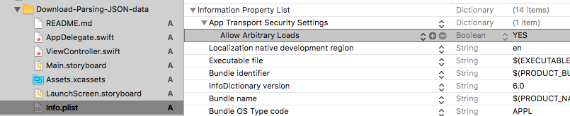
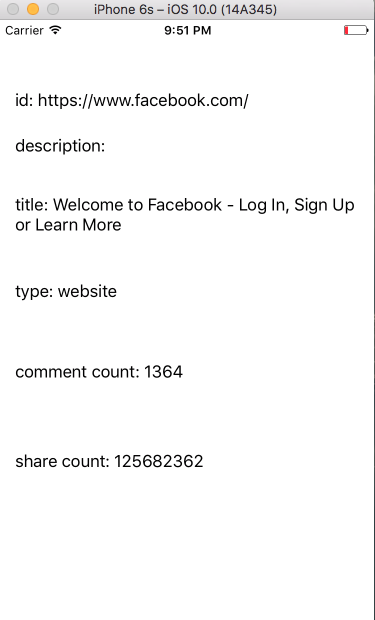

# Download-Parsing-JSON-data

Downloading and parsing JSON data in Swift 3.0. Using the graph API from Facebook. Did you ever want to show the share or comment facebook count of a link? With this code you can do it ;-).

Thanks to [Too Many Tutorials](http://toomanytutorials.blogspot.de/2016/06/downloading-and-parsing-json-data-in.html)

**Note:** If you use `http://...` in your URL, then probably you get this error in the debug console `NSLocalizedDescription=The resource could not be loaded because the App Transport Security policy requires the use of a secure connection.`. 

To use also an unsecure connection do this:

1. Open the `info.plist` file
2. Add the Key called `App Transport Security Settings` as `Dictionary` (Dictionary should be the default type)
3. Add the Subkey called `Allow Arbitrary Loads` as `Boolean` (Boolean should be the default type)

See also the Screenshot:

## Result

